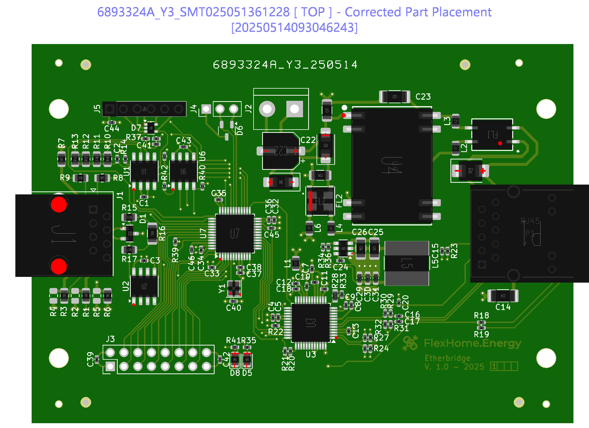
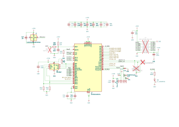

# Etherbridge_custom

This repository contains the code for the custom Etherbride-board. This board is base on a STM32H533CET6 MCU in a 48-pin LQFP package. 

Attached to it is a W5500 ethernet chip from Wiznet and a 93LC86 EEPROM. The external clock is provided by a 25MHz crystal oscillator. The W5500 gets its 25 MHz clock via the MCO1-pin from the MCU.

External interfaces are CAN, RS485, an UART as extra serial interface and the SWD port for programming and debugging. Also, a LED is connected to IO-pin PH1.

## Schematic

You can find the [full schematic here.](HW-Doc/Etherbridge_PCB.pdf)

## Pinout

| MCU Pin | Signal Name | Function                      | Mode      |
| ------- | ----------- | --------                      | ----      |
| PH0     | MAIN_CLK    | HSE_IN                        |           |
|         |             |                               |           |
| PA1     | RS485_DE    | USART2_DE                     | AF7       |
| PA2     | RS485_TX    | USART2_TX                     | AF7       |
| PA3     | RS485_RX    | USART2_RX                     | AF7       |
|         |             |                               |           |
| PA4     | WZ_RST_N    | W5500 Reset Active Low        | Output    |
| PB12    | WZ_INT_N    | W5500 Int In Active Low       | Input     |
| PB10    | WZ_CS_N     | W5500 Chip Select Active Low  | Output    |
| PA5     | WZ_SCK      | SPI1_CLK                      | AF5       |
| PA6     | WZ_MISO     | SPI1_MISO                     | AF5       |
| PA7     | WZ_MOSI     | SPI1_MOSI                     | AF5       |
| PA8     | WZ_CLK      | MCO1 W5500 Main Clock (25MHz) | AF0       |
|         |             |                               |           |
| PB15    | EEP_CS      | 93LC86 Chip Select            | Output    |
| PB1     | EEP_SCK     | SPI3_SCK                      | AF4       |
| PB0     | EEP_MISO    | SPI3_MISO                     | AF5       |
| PB2     | EEP_MOSI    | SPI3_MOSI                     | AF7       |
| PB13    | EEP_ORG     | MemOrg: low: x8; high: x16    | Output    |
| PB14    | EEP_PE      | Program Enable                | Output    |
|         |             |                               |           |
| PA9     | SER_TX      | USART1_TX                     | AF7       |
| PA10    | SER_RX      | USART1_RX                     | AF7       |
|         |             |                               |           |
| PA11    | CAN_RX      | FDCAN1_RX                     | AF9       |
| PA12    | CAN_TX      | FDCAN1_TX                     | AF9       |
|         |             |                               |           |
| PA13    | SWDIO       | Serial Wire Debug I/O         | AF0       |
| PA14    | SWCLK       | Serial Wire Debug CLK         | AF0       |
| PB3     | SWO         | Serial Wire  Debug Data Out   | AF0       |
|         |             |                               |           |
| PH1     | LED         | Spare Pin with LED            | Output    |
|         |             |                               |           |
| PA0     | IO_PA0      | Spare Pin                     | Analog In |
| PA15    | IO_PA15     | Spare Pin                     | Analog In |
| PB4     | IO_PB4      | Spare Pin                     | Analog In |
| PB5     | IO_PB5      | Spare Pin                     | Analog In |
| PB6     | IO_PB6      | Spare Pin                     | Analog In |
| PB7     | IO_PB7      | Spare Pin                     | Analog In |
| PB8     | IO_PB8      | Spare Pin                     | Analog In |
| PC13    | IO_PC13     | Spare Pin                     | Analog In |
| PC14    | IO_PC14     | Spare Pin                     | Analog In |
| PC15    | IO_PC15     | Spare Pin                     | Analog In |

